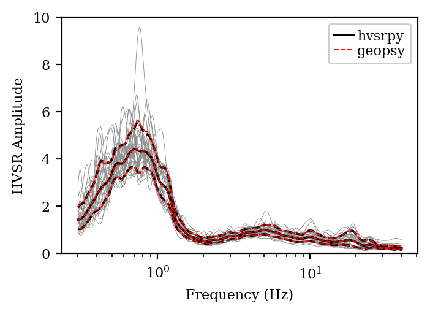
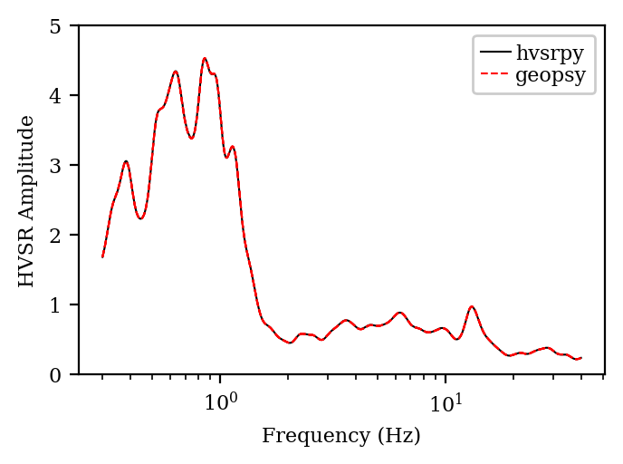
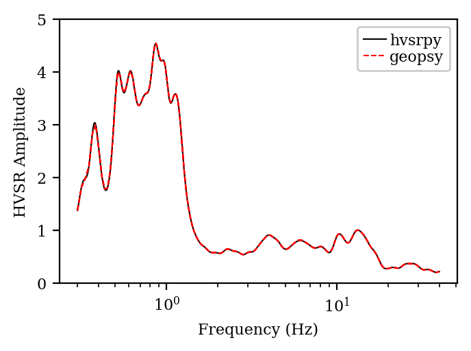

# _hvsrpy_ - A Python module for horizontal-to-vertical spectral ratio (H/V) calculations

> Joseph Vantassel, University of Texas at Austin

## About _hvsrpy_

---

`hvsrpy` is a Python module for performing horizontal-to-vertical spectral ratio
(H/V) calculations. `hvsrpy` was developed by Joseph P. Vantassel with
contributions from Dana M. Brannon under the supervision of Professor Brady R.
Cox at the University of Texas at Austin. The fully-automated frequency-domain
rejection algorithm implemented in `hvsrpy` was developed by Tianjian Cheng 
under the supervision of Professor Brady R. Cox at the Univesity of Texas at
Austin and detailed in Cox et al. (in review).

## Comparison of _hvsrpy_ with _geopsy_

---

While `hvsrpy` can be used to produce results exactly equal to the popular
open-source program geopsy , `hvsrpy` contains additional
functionality including:

- A fully-automated frequency-domain rejection algorithm.
- An option to use a log-normal distribution for the mean `f0` from the time
windows so H/V uncertainty can be represented consistently in terms of frequency
and period.
- Combination of the two orthoginal horizontal components using the geometric
mean.
- Direct access to the H/V data from each time window, not only the
mean/median curve.

After completing the __Getting Started__ section below, use the provided
examples to explore all of these new features.

To illustrate that `hvsrpy` can exactly reproduce the results from
Geopsy two comparisons are shown below. One for a single time window and one
for multiple time windows. More examples and the necessary information to
reproduce them if so desired are provided at the end of this document.

### Single Time Window

### Multiple Time Windows

## Getting Started

---

### Installing _sigpropy_ (a dependency of _hvsrpy_)

1. Download and unzip the provided zip file named `hvsrpy_v0.0.1`.

2. Move the directory `sigpropy` and its contents to the root directory of
  your main hardrive, this is typically the `C` drive on Windows.

3. Open a Windows Powershell (recommended) or Command Prompt window inside
the `sigpropy` directory. If using Windows Powershell you can do this with
`shift + right click` on the directory and selecting the option
`open PowerShell window here`. If using Command Prompt you will need to
navigate to that directory using the console.

4. Ensure you are in the correct directory by confirming it contains a
sub-directory call `sigpropy` and a file named `setup.py`. You can see the
contents of the current directory by using the command `ls` in Windows
Powershell or `dir` in Command Prompt.

5. If in the correct directory, install the module's dependencies with
`pip install -r requirements.txt`. Note that an internet connection is required
for the installation to be successful.

6. And install the module with `pip install .`.

7. Confirm that `sigpropy` was built successfully by reading the last few
lines printed to the console.

### Installing _hvsrpy_ and its dependencies

1. Move the directory `hvsrpy` and its contents to the root directory of
  your main hard drive, this is typically the `C` drive on Windows.

2. Open a Windows Powershell (recommended) or Command Prompt window inside
the `hvsrpy` directory.

3. Ensure you are in the correct directory by confirming it contains a
sub-directory call `hvsrpy` and a file named `setup.py`.

4. If in the correct directory, install the module's dependencies with
`pip install -r requirements.txt`.

5. And install the module with `pip install .`.

6. Confirm that `hvsrpy` was built successfully by reading the last few
lines printed to the console.

### Begin using _hvsrpy_

1. Copy the directory `examples` and its contents out of the directory `hvsrpy`
  which is now located on your main hard drive (recall _Step 1._ of the section
  __Installing _hvsrpy_ and its dependencies__) and move to any location of your
  choice.

2. Navigate to the copy of the `examples` directory and open the Jupyter
  notebook titled `simple_hvsrpy_interface.ipynb`.

3. Follow the instructions in the notebook for a no-coding-required introduction
  to the `hvsrpy` module.

## Reproducible Comparisons between _hvsrpy_ and _geopsy_

### Multiple Windows

All of the following examples utilize the same settings applied to different
noise records. The settings are provided below with the name of each
file provided above the corresponding figure. The noise records themselves
are provided in the `examples` directory included as part of this module, see
previous section for details, or can be found [here](https://www.designsafe-ci.org/data/browser/public/designsafe.storage.published/PRJ-2075).

#### Settings

- __Window Length:__ 60 seconds
- __Bandpass Filter Boolean:__ False
- __Cosine Taper Width:__ 10% (i.e., 5% in geopsy)
- __Konno and Ohmachi Smoothing Coefficient:__ 40
- __Resampling:__
  - __Minimum Frequency:__ 0.3 Hz
  - __Maximum Frequency:__ 40 Hz
  - __Number of Points:__ 2048
  - __Sampling Type:__ 'log'
- __Method for Combining Horizontal Components:__ 'squared-average'
- __Distribution for f0 from Time Windows:__ 'normal'
- __Distribution for Mean Curve:__ 'log-normal'

#### Results

__File Name:__ _UT.STN11.A2_C50.miniseed_

__File Name:__ _UT.STN11.A2_C150.miniseed_

__File Name:__ _UT.STN12.A2_C50.miniseed_

__File Name:__ _UT.STN12.A2_C150.miniseed_

### Single Window

The following examples use different processing settings to the same noise
record (_UT.STN11.A2_C50.miniseed_). The default settings are listed below such
that only the changes from these setting are noted for each example.

#### Default Settings

- __Window Length:__ 60 seconds
- __Bandpass Filter Boolean:__ False
- __Cosine Taper Width:__ 10% (i.e., 5% in geopsy)
- __Konno and Ohmachi Smoothing Coefficient:__ 40
- __Resampling:__
  - __Minimum Frequency:__ 0.3 Hz
  - __Maximum Frequency:__ 40 Hz
  - __Number of Points:__ 2048
  - __Sampling Type:__ 'log'
- __Method for Combining Horizontal Components:__ 'squared-average'
- __Distribution for f0 from Time Windows:__ 'normal'
- __Distribution for Mean Curve:__ 'log-normal'

#### Results

__Default Case:__ No deviation from those settings listed above.

__Window Length:__ 120 seconds.

__Cosine Taper Width:__ 20 % (i.e., 10% in geopsy)

__Cosine Taper Width:__ 0.2 % (i.e., 0.1% in geopsy)

__Konno and Ohmachi Smoothing Coefficient:__ 10

__Konno and Ohmachi Smoothing Coefficient:__ 80

__Number of Points:__ 512

__Number of Points:__ 4096

