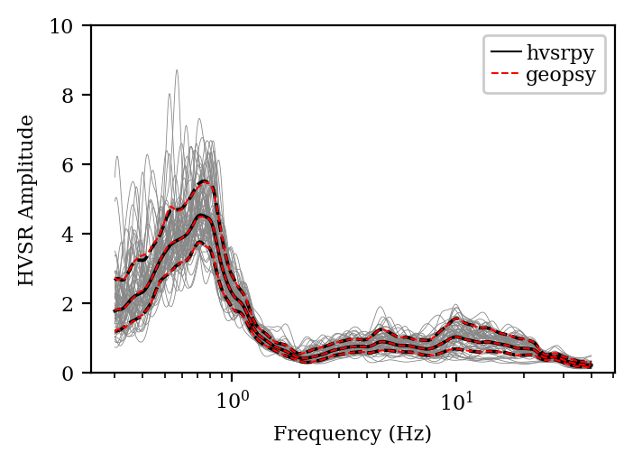
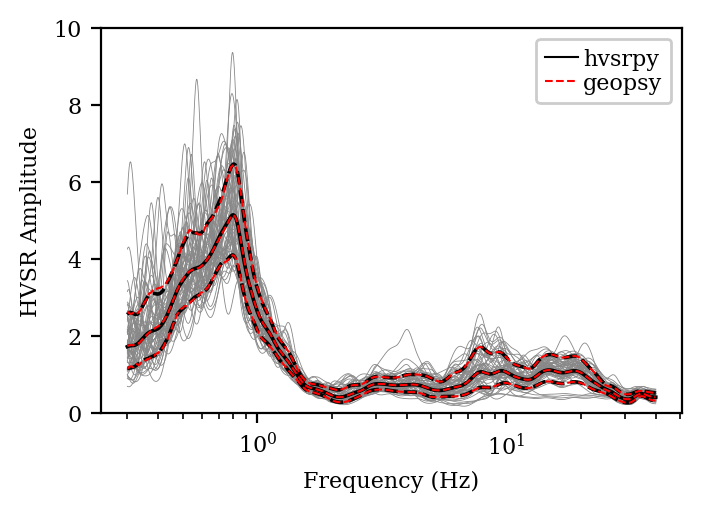
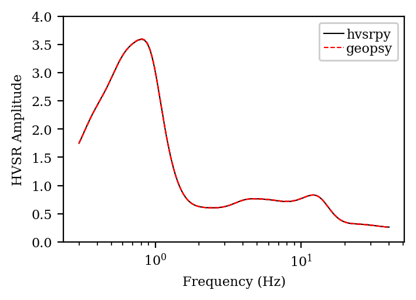
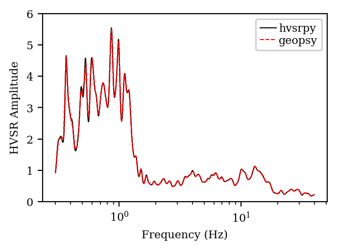

# _hvsrpy_ - A Python module for horizontal-to-vertical spectral ratio processing

> Joseph P. Vantassel, The University of Texas at Austin (jvantassel@utexas.edu)

## Table of Contents

---

- [About _hvsrpy_](#About-_hvsrpy_)
- [Why use _hvsrpy_](#Why-use-_hvsrpy_)
- [A Comparison of _hvsrpy_ with _Geopsy_](#A-comparison-of-_hvsrpy_-with-_Geopsy_)
- [Getting Started](#Getting-Started)
- [Additional Comparisons between _hvsrpy_ and _Geopsy_](#Additional-Comparisons-between-_hvsrpy_-and-_Geopsy_)
  - [Multiple Windows](#Multiple-Windows)
  - [Single Window](#Single-Window)

## About _hvsrpy_

---

`hvsrpy` is a Python module for performing horizontal-to-vertical spectral ratio
(H/V) processing. `hvsrpy` was developed by Joseph P. Vantassel with
contributions from Dana M. Brannon under the supervision of Professor Brady R.
Cox at The University of Texas at Austin. The fully-automated frequency-domain
rejection algorithm implemented in `hvsrpy` was developed by Tianjian Cheng
under the supervision of Professor Brady R. Cox at The University of Texas at
Austin and detailed in Cox et al. (in review).

## Why use _hvsrpy_

---

`hvsrpy` contains features not currently available in any other commercial or
open-source software, including:

- A fully-automated frequency-domain rejection algorithm, which allows spurious
time windows to be removed in a repeatable and expedient manner.
- A log-normal distribution for the fundemental site frequency (`f0`) so the
uncertainty in `f0` can be represented consistently regardless of whether it is
described in terms of frequency or period.
- Combining the two horizontal components using the geometric mean.
- Access to the H/V data from each time window, not only the
mean/median curve.
- A performant framework for batch-style processing.

## A comparison of _hvsrpy_ with _Geopsy_

---

To illustrate that `hvsrpy` can exactly reproduce the results from the popular
open-source software `Geopsy` two comparisons are shown below. One for a single
time window (left) and one for multiple time windows (right). Additional
examples and the information necessary to reproduce them are provided at the end
of this document.

 

## Getting Started

---

### Installing _sigpropy_ (a dependency of _hvsrpy_)

1. Download and unzip the provided zip file named `hvsrpy_v0.1.0`.

2. Move the directory `sigpropy` and its contents to the root directory of
  your main hardrive, this is typically the `C` drive on Windows.

3. Open a Windows Powershell (recommended) or Command Prompt window inside
the `sigpropy` directory. If using Windows Powershell you can do this with
`shift + right click` on the directory and selecting the option
`open PowerShell window here`. If using Command Prompt you will need to
navigate to that directory using the console.

4. Ensure you are in the correct directory by confirming it contains a
sub-directory call `sigpropy` and a file named `setup.py`. You can see the
contents of the current directory by using the command `ls` in Windows
Powershell or `dir` in Command Prompt.

5. If in the correct directory, install the module's dependencies with
`pip install -r requirements.txt`. Note that an internet connection is required
for the installation to be successful.

6. And install the module with `pip install .`. Note the period.

7. Confirm that `sigpropy` was built successfully by reading the last few
lines printed to the console.

### Installing _hvsrpy_ and its dependencies

1. Move the directory `hvsrpy` and its contents to the root directory of
  your main hard drive, this is typically the `C` drive on Windows.

2. Open a Windows Powershell (recommended) or Command Prompt window inside
the `hvsrpy` directory.

3. Ensure you are in the correct directory by confirming it contains a
sub-directory call `hvsrpy` and a file named `setup.py`.

4. If in the correct directory, install the module's dependencies with
`pip install -r requirements.txt`.

5. And install the module with `pip install .`. Note the period.

6. Confirm that `hvsrpy` was built successfully by reading the last few
lines printed to the console.

### Begin using _hvsrpy_

1. Copy the directory `examples` and its contents out of the directory `hvsrpy`
  which is now located on your main hard drive (recall _Step 1._ of the section
  __Installing _hvsrpy_ and its dependencies__) and move to a location of your
  choice.

2. Navigate to the copy of the `examples` directory and open the Jupyter
  notebook titled `simple_hvsrpy_interface.ipynb`.

3. Follow the instructions in the notebook for a no-coding-required introduction
  to the `hvsrpy` module.

## Additional Comparisons between _hvsrpy_ and _Geopsy_

---

### Multiple Windows

The examples in this section use the same settings applied to different
noise records. The settings are provided in the __Settings__ section and the
name of each file is provided above the corresponding figure in the __Results__
section. The noise records (i.e., _.miniseed_ files) are provided in the
`examples` directory included as part of this module or can be found
[here](https://www.designsafe-ci.org/data/browser/public/designsafe.storage.published//PRJ-2075/Thorndon%20Warf%20(A2)/Unprocessed%20Data/Microtremor%20Array%20Measurements%20(MAM)).

#### Settings

- __Window Length:__ 60 seconds
- __Bandpass Filter Boolean:__ False
- __Cosine Taper Width:__ 10% (i.e., 5% in Geopsy)
- __Konno and Ohmachi Smoothing Coefficient:__ 40
- __Resampling:__
  - __Minimum Frequency:__ 0.3 Hz
  - __Maximum Frequency:__ 40 Hz
  - __Number of Points:__ 2048
  - __Sampling Type:__ 'log'
- __Method for Combining Horizontal Components:__ 'squared-average'
- __Distribution for f0 from Time Windows:__ 'normal'
- __Distribution for Mean Curve:__ 'log-normal'

#### Results

__File Name:__ _UT.STN11.A2_C50.miniseed_

__File Name:__ _UT.STN11.A2_C150.miniseed_

__File Name:__ _UT.STN12.A2_C50.miniseed_

__File Name:__ _UT.STN12.A2_C150.miniseed_

### Single Window

The examples in this section apply different settings to the same noise
record (_UT.STN11.A2_C50.miniseed_). For brevity, the default settings are
listed in the __Default Settings__ section, with only the variations from
these settings noted for each example.

#### Default Settings

- __Window Length:__ 60 seconds
- __Bandpass Filter Boolean:__ False
- __Cosine Taper Width:__ 10% (i.e., 5% in Geopsy)
- __Konno and Ohmachi Smoothing Coefficient:__ 40
- __Resampling:__
  - __Minimum Frequency:__ 0.3 Hz
  - __Maximum Frequency:__ 40 Hz
  - __Number of Points:__ 2048
  - __Sampling Type:__ 'log'
- __Method for Combining Horizontal Components:__ 'squared-average'
- __Distribution for f0 from Time Windows:__ 'normal'
- __Distribution for Mean Curve:__ 'log-normal'

#### Results

__Default Case:__ No variation from those settings listed above.

__Window Length:__ 120 seconds.

__Cosine Taper Width:__ 20 % (i.e., 10 % in Geopsy)

__Cosine Taper Width:__ 0.2 % (i.e., 0.1 % in Geopsy)

__Konno and Ohmachi Smoothing Coefficient:__ 10

__Konno and Ohmachi Smoothing Coefficient:__ 80

__Number of Points:__ 512

__Number of Points:__ 4096

